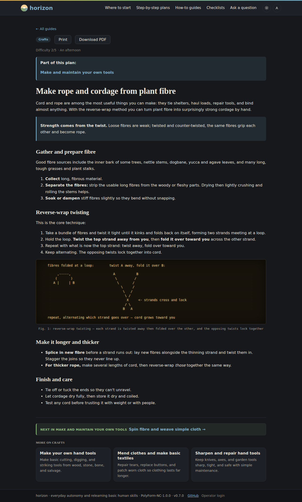
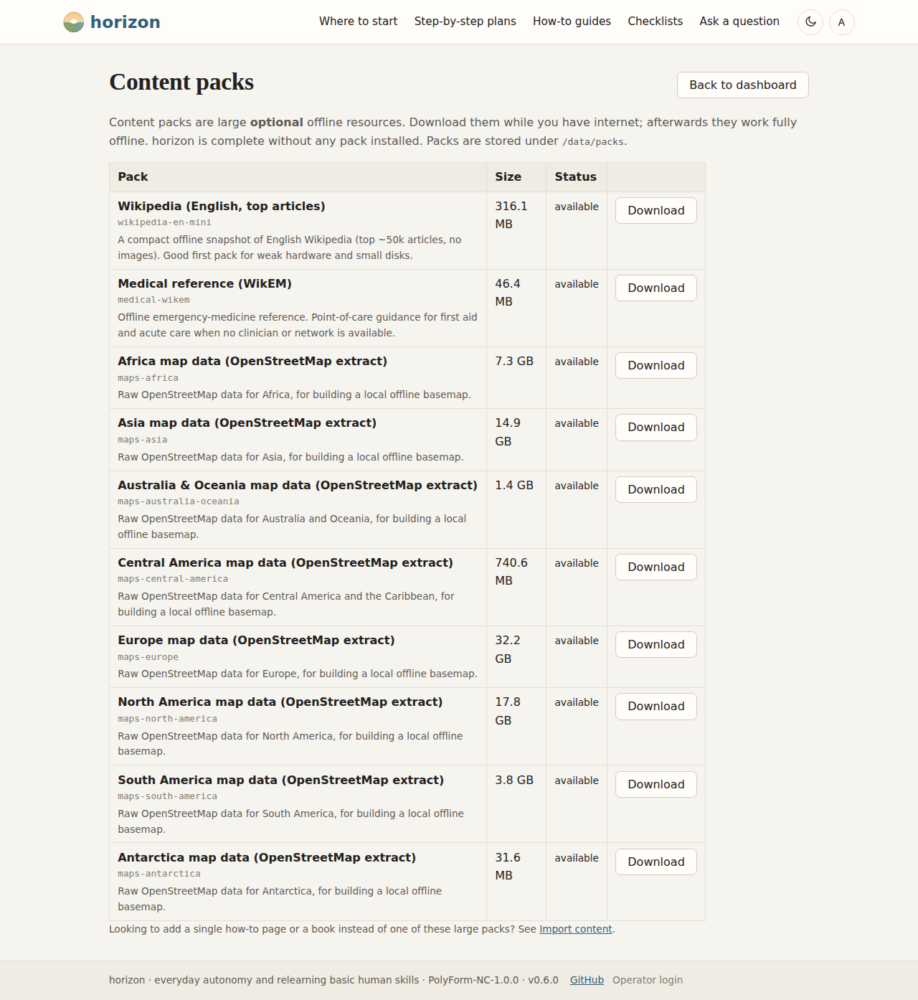

<div align="center">
  


# horizon
**An offline-first autonomy node for basic human skills.**

[](LICENSE)
[](https://www.python.org/)
[](https://fastapi.tiangolo.com/)
[](https://github.com/astral-sh/ruff)
[](#)
[](#roadmap--changelog)

</div>

horizon is a small, self-contained server you run on your own hardware (a
Raspberry Pi, mini-PC, or LXC/VM). It gives a household or neighbourhood a
library of **visual step-by-step guides**, a few curated **step-by-step plans**,
and a **local AI assistant** across water, food, energy, shelter, health,
cooperative governance, survival basics, culture, essential language, crafts &
repair, emergencies, plant-based cooking, practical calculations, local
technology, and sustainable mobility — all working **fully offline** after
setup, with no cloud dependency at runtime.

horizon is about everyday autonomy and relearning basic human skills. Most of us
are one dead Wi-Fi signal away from being stuck — a single camping trip is enough
to show how much practical know-how we've quietly outsourced to the internet.
horizon puts those basic human skills back within reach: living well off-grid,
sustainably and without coercion.

> **Status:** v0.7.0. The v0.1 scaffold (data model, APIs, content layout) is
> complete, with a design system, light/dark theming, an expanded content
> library, printable checklists, a UX layer for non-technical neighbours, an
> accessibility pass (v0.6), and — new in v0.7 — an in-browser **reference
> library** for downloaded offline-Wikipedia/WikEM content packs, a solarpunk
> landing hero, and around twenty new guides (camping, disaster response,
> navigation, plant diagnosis) threaded into new step-by-step plans. See
> [Roadmap & changelog](#roadmap--changelog) and [ROADMAP.md](ROADMAP.md).


**Contents:** [Features](#features) · [Screenshots](#screenshots) · [Quickstart](#quickstart) · [Docker](#docker-recommended) · [Bare-metal](#bare-metal) · [Configuration](#configuration) · [Documentation](#documentation) · [Roadmap & changelog](#roadmap--changelog)

## Features

- **Guides first, with curated "step-by-step plans".** Guides are the unit you
  browse and read; a small set of plans string several guides together in the
  order you'd work through them (e.g. *test water → choose treatment → build a
  slow sand filter*). Every guide ends with a "read further" footer.
- **Fifteen skill categories.** Water, food, energy, shelter, health,
  cooperation, survival basics, culture, essential language, crafts & repair,
  emergencies, plant-based cooking, practical calculations, local technology,
  and sustainable mobility — each with built-in guides, no download required.
- **Visual guides + print mode.** Markdown guides with figures, ASCII diagrams,
  comparison tables, and callouts (`Pick this if` / `Avoid if` / `Do now` …),
  rendered to HTML for the web and to a high-contrast **A4 PDF** for printing.
- **Printable checklists.** Tick-able lists (go-bag, water/food stores, first-aid
  kit…) auto-discovered from `content/checklists/`; ticks saved on-device only.
- **Reference library.** Download an offline Wikipedia or WikEM snapshot
  (**content packs**) and read it right in the browser — full-text search plus an
  article view, no external Kiwix viewer needed.
- **Map viewer.** Download raw OpenStreetMap data for your country (also a
  **content pack**), render it once, off the node, into an `.mbtiles` basemap,
  and pan/zoom it right in the browser — no rendering on weak hardware, no
  external map service.
- **Decision guides + "find your starting point".** Guides that help you *choose*,
  not only *do*; describe a goal in plain words and horizon recommends guides and
  plans to begin with, matched locally.
- **Local AI assistant (RAG).** Answers grounded in *your* local guides and "md
  skills", always citing the guides used — runs against a local model, never the
  cloud, and can be turned off by the operator.
- **Made for non-technical neighbours.** Plain-language navigation, guide search,
  a phone-friendly responsive layout, and plain-language answers by default.
- **Comfortable to look at, day or night.** A calm "paper & ink" design with a
  solarpunk streak in light and dark themes, applied consistently across every
  page (admin included). All styling is vendored — no external fonts or CDNs —
  and print/low-power/e-ink modes keep their high-contrast palettes.
- **Accessible by default.** A "Skip to content" link, labelled landmarks, a
  visible focus ring, a tablet breakpoint, and an on-device text-size/high-contrast
  setting — all remembered locally, no account required.
- **Built-in values.** Sustainability, non-authoritarian cooperation, fairness,
  and anti-exploitation are baked into the assistant via md skills.
- **Maintainable from the browser.** A token-gated admin panel browses the whole
  library and a **Check & repair** page diagnoses the node in plain language,
  offers one-click repairs, and shows a recent-events feed — no SSH or restart.
- **Simple, stable APIs + full CLI.** Other projects can link to plans/guides via
  the read-only [Knowledge API](docs/api.md); `horizon-admin` drives a headless
  node with the web UI switched off.

## Screenshots

A guide with a captioned ASCII diagram — the dark theme's glowing amber
"terminal" treatment (the light theme renders it as a graph-paper notebook
instead; no image file needed either way — it renders the same raw, in a CLI,
or on the web):



The admin **Content packs** page, where an operator downloads optional
offline resources (Wikipedia/WikEM snapshots, per-country map data) while
online, for fully offline use afterwards:



## Quickstart

### No git, no Docker? Use the curl installer

```bash
curl -fsSL https://raw.githubusercontent.com/richardkfm/horizon/main/scripts/get-horizon.sh | bash
cd horizon
```

The script only downloads and extracts a source tarball over HTTPS — no root,
no GitHub account, and it runs nothing else automatically, so it carries the
same trust as `git clone` would. Prefer not to pipe curl into bash at all?
Download it, read it, then run it:

```bash
curl -fsSL https://raw.githubusercontent.com/richardkfm/horizon/main/scripts/get-horizon.sh -o get-horizon.sh
less get-horizon.sh   # read it before running anything
bash get-horizon.sh
cd horizon
```

Either way you now have a local `horizon/` checkout — continue with **Docker**
or **bare-metal** below (skip their `git clone` step, you already have the
source).

### Docker (recommended)

```bash
git clone https://github.com/richardkfm/horizon && cd horizon   # or the curl installer above
docker compose up -d
```

Then open **http://&lt;host-ip&gt;:8080** from any device on the local network.
On first run horizon seeds its bundled content and builds the search index.

`config.yaml` ships in the repo with safe defaults and is bind-mounted into the
container, so editing it always takes effect — no copy step needed. After
changing it, apply with `docker compose up -d --force-recreate`.

This default install is small and stays fully offline — **no model runtime is
pulled**. The "Ask a question" assistant falls back to local guide search until
you give it a model. Enabling the optional local AI, finding the admin token,
and every config option are covered in **[docs/operating.md](docs/operating.md)**.

### Bare-metal

```bash
git clone https://github.com/richardkfm/horizon && cd horizon   # or the curl installer above
```

```bash
# System deps for PDF/print mode (Debian/Ubuntu example):
sudo apt install libpango-1.0-0 libpangocairo-1.0-0 libcairo2 \
                 libgdk-pixbuf-2.0-0 libffi-dev shared-mime-info

python -m venv .venv && source .venv/bin/activate
pip install -e .                 # lean, offline-first install
# pip install -e .[ai]           # optional: vector search for the AI assistant

uvicorn horizon.main:app --host 0.0.0.0 --port 8080
```

horizon also runs on Debian/Arch, Proxmox LXC, Raspberry Pi, and mini-PCs.
Clients connect by browser over the local network. For an unattended box the
installer sets up a service account, virtualenv, data dir, and systemd unit:

```bash
sudo ./packaging/install.sh
sudo systemctl enable --now horizon
```

Common tasks are also wrapped in a `Makefile` (`make help`): `make dev`,
`make run`, `make test`, `make lint`, `make build`, `make docker`.

## Configuration

Edit `config.yaml` directly (tracked in the repo with safe defaults; see
`config.example.yaml` for the fully annotated reference). Key settings:
`server.port`, `data_dir`/`database`, `llm.*`, `vectordb.*`, `rag.top_k`,
`ai.no_jargon_default`, `assistant.enabled`, `power.low_power`, `ethics.*`, and
`content_packs.dir`. `web.enabled` (default `true`) toggles the web UI; turn it
off for a headless JSON-API + CLI node.


Full detail — the admin token, how to run CLI, the optional local model runtime, environment
overrides — is in **[docs/operating.md](docs/operating.md)**.

## Documentation

- **[docs/api.md](docs/api.md)** — HTTP API reference (Knowledge API, AI API) and
  optional integrations (`neighbourgood`, `moral-core`). Interactive docs at `/docs`.
- **[docs/authoring-content.md](docs/authoring-content.md)** — adding guides,
  checklists, step-by-step plans, and md skills; importing WikiHow pages and books.
- **[docs/operating.md](docs/operating.md)** — configuration, the local model
  runtime, the `horizon-admin` CLI, and content packs.

## Roadmap & changelog

v0.1 was built in vertical slices, with the local model **last** so horizon is
useful before any LLM is involved. That scaffold is complete, and on top of it
have shipped: a UX layer for non-technical neighbours, a "paper & ink" design
system with dark/light theming, a deeper "what to pick" content library, admin
**check & repair** diagnostics with one-click repairs (v0.4), printable
**checklists**, guide **figures**/**ASCII diagrams**, an `horizon-content import`
command (v0.5), the design system applied across every page plus an
accessibility pass (v0.6), and — new in v0.7 — an in-browser **reference
library** for downloaded ZIM content packs, a solarpunk landing hero, and a
broad content expansion across survival, health, food, and emergencies. The
path from here stays lean and open (no accounts, no profiles, no tracking) —
see **[ROADMAP.md](ROADMAP.md)** for what's next and
**[CHANGELOG.md](CHANGELOG.md)** for notable changes.

## License

[PolyForm Noncommercial 1.0.0](LICENSE) — free for noncommercial use (personal,
educational, charitable, research, and government use); commercial use is not
permitted without a separate agreement with the copyright holder.
