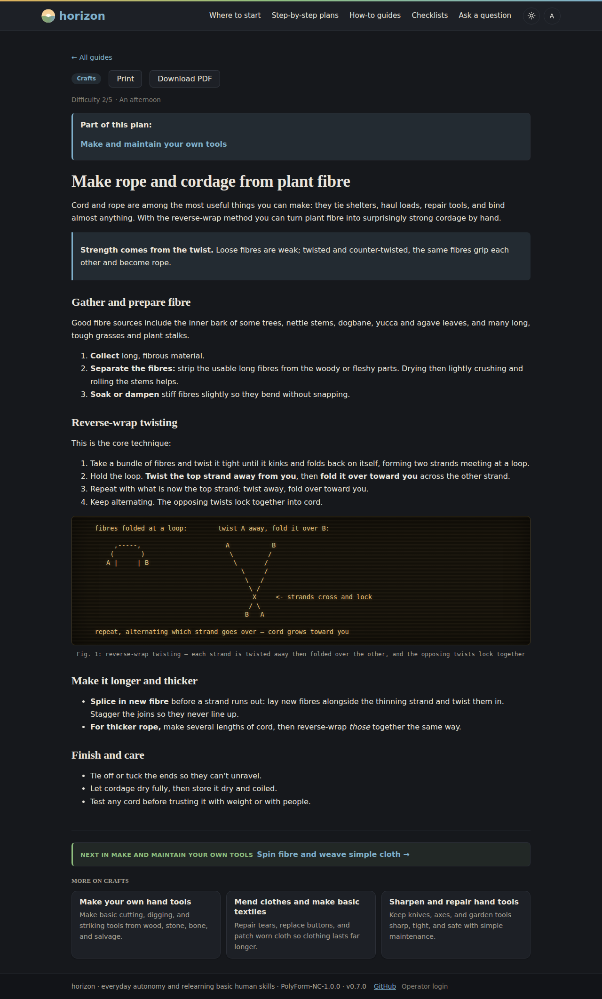
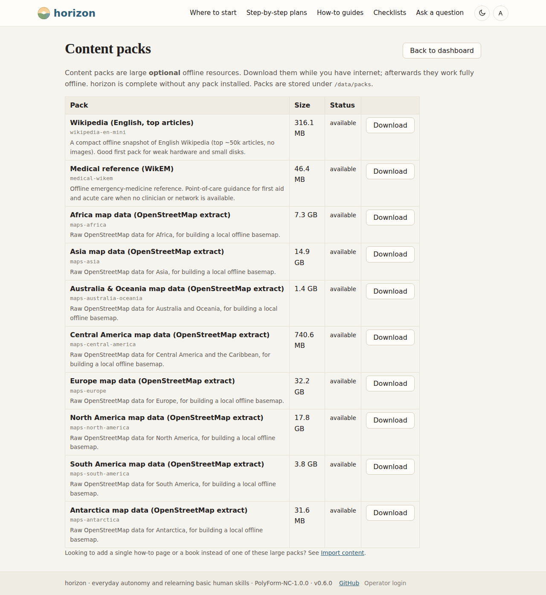

<div align="center">
  


# horizon
**An offline-first autonomy node for basic human skills.**

[](LICENSE)
[](https://www.python.org/)
[](https://fastapi.tiangolo.com/)
[](https://github.com/astral-sh/ruff)
[](#)
[](CHANGELOG.md)

</div>

horizon is a small server you run on your own hardware — a Raspberry Pi,
mini-PC, or VM. It gives a household or neighbourhood **visual how-to guides**,
**step-by-step plans**, and a **local AI assistant**. Fully offline after setup.

Most of us are one dead Wi-Fi signal away from being stuck. horizon puts basic
human skills back within reach: living well, sustainably, and without coercion.


## What you get

- **Visual guides** across 15 topics — water, food, energy, health, and more.
- **Step-by-step plans** that thread guides into a path.
- **Print-ready** A4 PDFs and tick-able checklists.
- **Offline extras:** a Wikipedia reference library and a map viewer.
- **Local AI assistant** that cites your guides. No cloud. Optional.
- **Made for neighbours:** plain language, phone-friendly, accessible.

→ [All features](docs/features.md)

## Screenshots

A guide with an ASCII diagram, dark theme:



The admin **Content packs** page, for downloading offline extras:



## Quickstart

```bash
git clone https://github.com/richardkfm/horizon
cd horizon
docker compose up -d
```

Open **http://&lt;host-ip&gt;:8080** on any device in your network.

No Docker or git? Bare-metal, curl installer, systemd →
[Install guide](docs/install.md).

## Configuration

Edit `config.yaml` — it ships with safe, offline defaults.


Admin token, CLI, local AI, content packs →
[Operating guide](docs/operating.md).

## Documentation

- [Install](docs/install.md) — Docker, bare-metal, curl, systemd
- [Features](docs/features.md) — the full tour
- [Operating](docs/operating.md) — config, CLI, AI, packs
- [Authoring content](docs/authoring-content.md) — guides, plans, imports
- [API](docs/api.md) — Knowledge API and AI API

## Status

**Status:** v0.9.3 — see [CHANGELOG](CHANGELOG.md) and [ROADMAP](ROADMAP.md).

## License

[PolyForm Noncommercial 1.0.0](LICENSE) — free for noncommercial use.
Commercial use needs a separate agreement.
